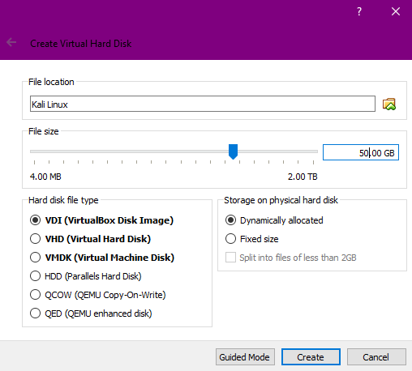

# Setting Up The Attacking Machine(s) - [Not Final]

## Notes:
I will be showing how to setup the attacking environment in a virtual machine (VM). Feel free to install the OS on a storage drive like you would for a normal OS. I actually bought a small SSD so I can dual-boot Windows and Kali. When I was doing this I had to go into the GRUB boot loader, which for Kali is the blue screen when you boot where you can choose what to boot, and change the default root directory. Hopefully you don't have to do this.

A large portion of this lesson is going to be on other websites. I apologize and this will not be how the other lessons are.

## Download All The Things:
For the attacking machine you will need a Linux machine with the required tools. It can be Kali, ParrotSec, Ubuntu, or any other. I would recommend Kali because it's popular and comes with an insane amounts of tools. If you need something more light-weight then I would recommend ParrotSec.
* <b>Kali:</b> https://www.kali.org/downloads/
 Note that for Kali there are many different options. Those are different desktop managers. To keep things simple, and to get what most people have, just choose "Kali Linux 64 Bit".

* <b>ParrotSec</b>: https://www.parrotsec.org/download-security.php
 There will be two options: "Live+Installer ISO" and "Virtual Appliance". The ISO will require you to go through the install process to set it up. The other one is a pre-built virtual machine. I would recommend getting the ISO and installing it yourself.
* <b>Ubuntu</b>: https://www.ubuntu.com/download/desktop
 Get the LTS (Long Term Support) version of Ubuntu. It's the more stable version.

Whatever OS you use, get the 64 bit version or you may encounter issues. You might want to also get a 32 bit Linux OS for when we get to binary exploitation. However, for that I would recommend just getting something like Ubuntu instead of something like Kali since we wont be using many different tools.

## Setting Up VM:
I recommend VirtualBox for creating the virtual machines since it's free. You can use VMWare if you would like, however I won't be covering it.  
  
Before we get started, make sure Intel Virtualization Technology and VT-d are both enabled in the BIOS.

* Download and install VirtualBox as well as the VirtualBox Extension Pack from here:
  https://www.virtualbox.org/wiki/Downloads

Next let's setup the machines.

1. Click the blue button to make a new VM. Switch to "Expert Mode" by clicking the button in the bottom right. I do this so I don't have to click a "Next" button multiple times.
2. Set the VM's name to anything, such as "Kali Linux". Set the type to "Linux" and the version to "Other Linux (64 bit)". There are 1024MB in one GB so multiply how many GB of RAM you want by 1024. I would recommend 4GB of memory so you would set 4096MB of RAM.
 It should look like this:

  

3. Click create. The "File Size" is how much storage you will give the VM. Give the VM at least 30GB, I would recommend 50GB. You can change the location of the VM's storage drive by clicking the folder icon next to the name. This is helpful if one of your physical drives doesn't have much room.
 It should look like this:

  

4. Click "Create" and that's done!
5. Now go to the settings of that VM by highlighting and clicking the gear at the top or right clicking the VM.
6. Go to "Storage", click on the CD under storage devices, then click the CD icon on the right which will show a drop down menu. Then click "Choose Virtual Optical Disk File" and select the ISO you downloaded. See image:

  

7. Go to the "Network" tab and select "Bridged Adapter". This will let the VM act like another machine on your network. We will change this later, but it will do for now. See image:

  

8. I would recommend going to the "Display" tab and setting the video memory amount to the highest possible. You may also find that enabling 3D acceleration will help with VM performance. It's important to know that a VM is going to be a little slow.

## Setting Up/Installing OS:
Now it's time to actually install the OS. As previously mentioned, be sure you give the OS a bridged connector and the internet is working. The OS will need an internet connection in order to install some things. If you setup the VM correctly it should all work fine. I won't be showing you how to install the system because it's pretty straight forward and I'm lazy, so instead here are two different links that show you:  
https://docs.kali.org/installation/kali-linux-hard-disk-install  
or  
https://linoxide.com/distros/learn-method-install-kali-linux-virtualbox/  
Even though the installation is for installing to a hard drive (HDD) it will work for the VM. However, when install you should select the disk that says something like "VBOX HARDDISK".

## Updating:
To update Linux open a terminal, and type "apt update" then "apt upgrade". You will prompted to confirm the upgrade and type "y", you can also just press enter. If it asks about anything else, just use your best judgment. Future note: you can use the "-y" flag to automatically accept some prompts.

## Installing VirtualBox Guest Additions
You can install the VBox guest additions in two ways.  
* You should be able to just run "apt-get install -y virtualbox-guest-x11".  
* See this link for more:  
https://docs.kali.org/general-use/kali-linux-virtual-box-guest  

I apologize for all the links, but this stuff is really tedious to go over. I assure you that I will be doing most of the teaching in the future :).
