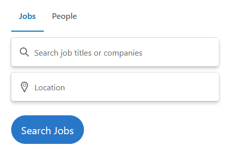

# Job Sites and Postings
Another important thing to know is what the company is using in terms of platforms, programming languages, services, software, etc. One of the easiest ways to find this out is by looking at job posting sits. Popular sites include [Linkedin](https://www.linkedin.com/), [Indeed](https://www.indeed.com/), and [Monster](https://www.monster.com/).

### Finding Information
Let's try to find what programming languages GitHub uses or is made with. To do this let's use [Linkedin](https://www.linkedin.com/). To start, clear the search boxes and press "Search Jobs". It should look like the image below.

  

Once you press "Search Jobs" the query will be sent. You should now see some tabs at the top, one of them should say "Company". This allows us to search by company. Choose GitHub and press "Done". It will now show only job postings for GitHub.
LinkedinSearchResults01.png
We can see right at the top there is a posting for a software engineer. This could help us identify what programming languages and technologies they are using. See the images below:
Red is important, orange is mildly important, and yellow is just nice to know.

  

  

**Important (Red):**
* From these images alone we know that they are using Go, Ruby, and JavaScript as some of their programming languages. We also see that RoR (Ruby on Rails), SQL, the RESTful, and GraphQL are possibly being used. These are important to know. They could help us shape our attacks. For example, since they are using SQL we know that we should primarily try SQL injection over NoSQL injection (although it's best to still try both). These are attack vectors, which we will talk about later.

**Mildly Important (Yellow):**
* Based on the "Preferred Qualifications" we can see that they use OAuth, SAML, SCIM, LDAP, Azure Active Directory, Okta, OneLogin, and Ping - or something like them. Don't worry if you don't know all of these, I don't. That's where the beautiful internet comes in handy. Look it up! These are only mildly important because we aren't sure if they are being used, or things similar to them are being used. Either way, it's still good to keep this in mind.

**Nice To Know (Yellow):**
* Over 36 million people use GitHub and there are over 100 million repositories. This information will most likely not be helpful, but it does let us know that GitHub is extremely popular and big. That usually means that they will make more mistakes ;).

## Final Notes:
I only went of Linkedin but you should look at other sites as well. Also, look at multiple jobs. I only showed a software engineer job, it's a good idea to also look at both physical and digital security roles.