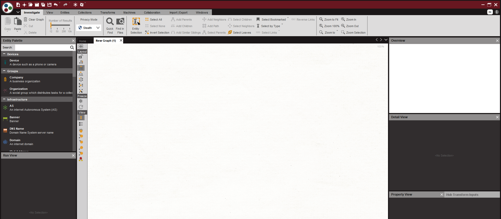

# Maltego - WIP
Maltego is a tool that can do a massive amount of OSINT for us. It does have a paid version, but we will be using the free version.  
You can get Maltego here: https://www.paterva.com/web7/downloads.php.

### Getting Started:
You will need to make an account to get started. Again, I will be using the free version. To make a new graph, click the icon in the top left that looks like a page with a plus sign. You can also click the Maltego icon and choose "New". You should now see something like in the image below.

  

On the left you can choose from a variety of entities. Drag and drop the website entity onto the graph. Set the URL to www.github.com. You can then right click the entity and choose a transform. This will perform an action such as DNS enumeration. In fact, let's go ahead and choose "To DNS Name" under "All Transforms". If you leave it with the default options, you will get a few www#.github.com hostnames.

I'm going to cut this lesson short here. I feel like Maltego is best learned and enjoyed by playing around with it yourself. Also, I want to start teaching the fun stuff.

## Final Notes:
Play around with Maltego, it can do so many things. I will probably update this lesson in the future.